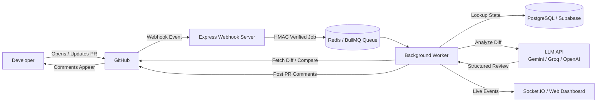
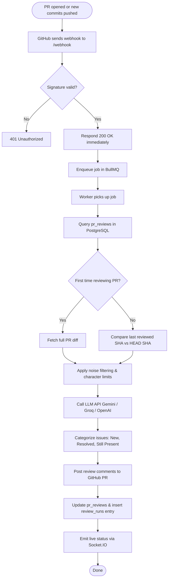

# Diffie

An automated GitHub App that performs intelligent, incremental code reviews on Pull Requests.

When a developer opens or updates a PR, Diffie fetches the diff, analyzes changed code using LLMs (Google Gemini, Groq, or OpenAI), and posts structured feedback — summary, potential bugs, edge cases, and inline code suggestions — directly back to GitHub.

---

## Quick Links

- **Web Dashboard**: [cody-delta-ten.vercel.app](https://cody-delta-ten.vercel.app/)
- **Install GitHub App**: [Install `mohit-pr-review-bot` on your Repositories](https://github.com/apps/diffie-bot/installations/new)
- **GitHub App Settings**: [App Developer Settings](https://github.com/settings/apps/mohit-pr-review-bot)

---

## Table of Contents

- [Features](#features)
- [High-Level Architecture](#high-level-architecture)
- [End-to-End Request Flow](#end-to-end-request-flow)
- [Incremental Reviews & Database State](#incremental-reviews--database-state)
- [Component Breakdown](#component-breakdown)
- [Tech Stack](#tech-stack)
- [Project Structure](#project-structure)
- [Setup & Local Development](#setup--local-development)
- [Deployment](#deployment)
- [License](#license)

---

## Features

- **Instant Automated Reviews:** Triggers immediately on `pull_request.opened` or `pull_request.synchronize` (new commits).
- **Incremental Commit Tracking:** Uses PostgreSQL to track the last-reviewed commit SHA. When new commits are pushed to an open PR, Diffie compares only what changed (`compareCommits`), highlighting **New**, **Resolved**, and **Still Present** issues.
- **Inline Comments & High-Level Summary:** Posts actionable line comments directly on problematic code blocks alongside an overall summary comment.
- **Multi-LLM Engine Support:** Powered by Google Gemini (`gemini-3.6-flash`), OpenAI, and Groq, configurable per repository via the web dashboard.
- **Secure GitHub App Authentication:** Uses short-lived, auto-rotating GitHub App installation tokens (`@octokit/auth-app`) and HMAC-SHA256 signature verification.
- **Async Queue Architecture:** BullMQ + Upstash Redis ensures webhooks respond instantly with `200 OK`, preventing GitHub webhook timeouts while background workers handle heavy LLM analysis.
- **Noise Filtering & Diff Chunker:** Automatically ignores lockfiles (`package-lock.json`, `yarn.lock`), binaries, and generated files, managing character budgets to prevent LLM context limit overflow.
- **Realtime Dashboard:** Built with Next.js, React, and Socket.IO to monitor live job pipelines, worker execution stages, and review history.

---

## High-Level Architecture



---

## End-to-End Request Flow



---

## Incremental Reviews & Database State

Diffie keeps track of PR review state in PostgreSQL (`docker/postgres/init.sql`) to prevent duplicate reviews and provide intelligent progress tracking across commits:

- **`pr_reviews` Table:** Stores current PR metadata (`owner`, `repo`, `pr_number`, `last_reviewed_sha`, `last_comment_id`, `last_issues`).
- **`review_runs` Table:** Append-only history table recording every review execution (`commit_sha`, `summary`, `issues`, `file_count`). Enforces idempotency via `UNIQUE (pr_review_id, commit_sha)` constraint.

When new commits are pushed:
1. Diffie fetches the diff using GitHub's `compareCommits(lastReviewedSha, headSha)` API.
2. If force-push or rebase makes the previous SHA unreachable, Diffie safely falls back to a full PR review.
3. Issues are compared against past runs using a severity + word-overlap heuristic to classify resolved vs. newly introduced bugs.

---

## Component Breakdown

| Component | Technology | Responsibility |
|---|---|---|
| **Web Dashboard** | Next.js, React, Vercel | User onboarding, repository selection, and API key management |
| **Webhook Receiver** | Express, Node.js, TypeScript | Receives GitHub events and validates HMAC signatures |
| **Job Queue & Worker** | BullMQ, Upstash Redis | Buffers incoming jobs and executes background diff fetching & LLM reviews |
| **State Storage** | PostgreSQL, Supabase | Tracks review history, last-reviewed commit SHAs, and issue resolution state |
| **Diff Engine** | Octokit REST API | Retrieves PR file diffs and commit comparisons from GitHub |
| **LLM Client** | `@google/genai`, OpenAI, Groq | Sends engineered prompts and parses structured JSON reviews |
| **Comment Poster** | GitHub Issues/Pull Requests API | Posts top-level summaries and inline file suggestions to GitHub PRs |
| **Realtime Streamer** | Socket.IO, Redis Pub/Sub | Broadcasts live job updates (`started`, `fetched`, `reviewed`, `completed`) |

---

## Tech Stack

- **Frontend / Dashboard:** Next.js (App Router), React, Tailwind CSS, Vercel
- **Backend Runtime:** Node.js, TypeScript, Express.js
- **Database & Cache:** PostgreSQL (Supabase / Docker), Redis (Upstash / BullMQ)
- **AI Integrations:** Google Gemini (`gemini-3.6-flash`), Groq API, OpenAI API
- **GitHub Integration:** `@octokit/auth-app`, `@octokit/rest`, GitHub Webhooks
- **Realtime:** Socket.IO, Redis Pub/Sub

---

## Project Structure

```
Diffie/
├── client/                     # Next.js web app (deployed on Vercel)
│   ├── src/                    # UI pages, components, & dashboard
│   └── package.json
├── docker/                     # Local dev environment setup
│   ├── postgres/init.sql       # Database schema (pr_reviews, review_runs)
│   └── docker-compose.yml
├── src/                        # Express server & background worker
│   ├── server.ts               # Webhook receiver & Socket.IO server
│   ├── verifySignature.ts      # HMAC-SHA256 GitHub signature validator
│   ├── db/                     # PostgreSQL database queries & pool setup
│   │   ├── pool.ts
│   │   ├── prReviews.ts
│   │   └── reviewRuns.ts
│   ├── github/                 # GitHub App authentication & API interactions
│   │   ├── appAuth.ts          # Installation token manager
│   │   ├── githubapis.ts       # Diff fetching & comment posting
│   │   └── repoConfig.ts
│   ├── llm/                    # AI prompt construction & API callers
│   │   ├── client.ts           # Gemini / Groq / OpenAI interface
│   │   └── compareIssues.ts    # Incremental issue diffing logic
│   └── queue/                  # BullMQ job queue & background worker process
│       ├── queue.ts
│       ├── publisher.ts
│       └── worker.ts
├── .env.example                # Environment variables template
├── package.json
├── Plan.md                     # Architectural roadmap & completed features log
└── README.md
```

---

## Setup & Local Development

### Prerequisites

- Node.js (v18+)
- Redis instance (local or Upstash Redis)
- PostgreSQL database (local Docker container or Supabase instance)
- A GitHub App registered with Pull Request permissions (`read` diffs, `write` comments)

### 1. Install Dependencies

```bash
npm install
npm --prefix client install
```

### 2. Environment Configuration

Copy `.env.example` to `.env` and fill in your secrets:

```bash
cp .env.example .env
```

Key environment variables:
- `GITHUB_APP_ID`, `GITHUB_PRIVATE_KEY` (or `PRIVATE_KEY_PATH`)
- `GITHUB_WEBHOOK_SECRET`
- `REDIS_URL` (e.g. `redis://localhost:6379`)
- `DATABASE_URL` (PostgreSQL connection string)
- `GEMINI_API_KEY`, `OPENAI_API_KEY`, `GROQ_API_KEY`

### 3. Run Local Database (Docker)

```bash
docker-compose up -d
```

### 4. Start Development Servers

Run the backend server, worker process, client dashboard, and ngrok tunnel concurrently:

```bash
npm run dev:all
```

---

## Deployment

- **Web Dashboard:** Deployed on [Vercel](https://cody-delta-ten.vercel.app/).
- **Backend Service:** Express webhook server + BullMQ background worker deployed on Render / Railway.
- **Database & Cache:** Managed PostgreSQL hosted on Supabase; Redis hosted on Upstash.

---

## License

ISC License. Built for modern developer workflows.
