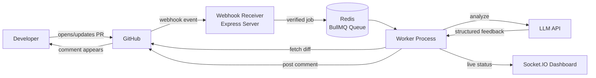
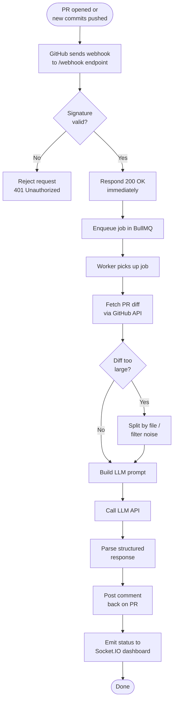
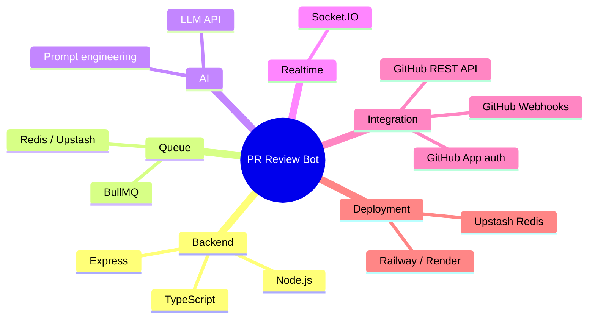
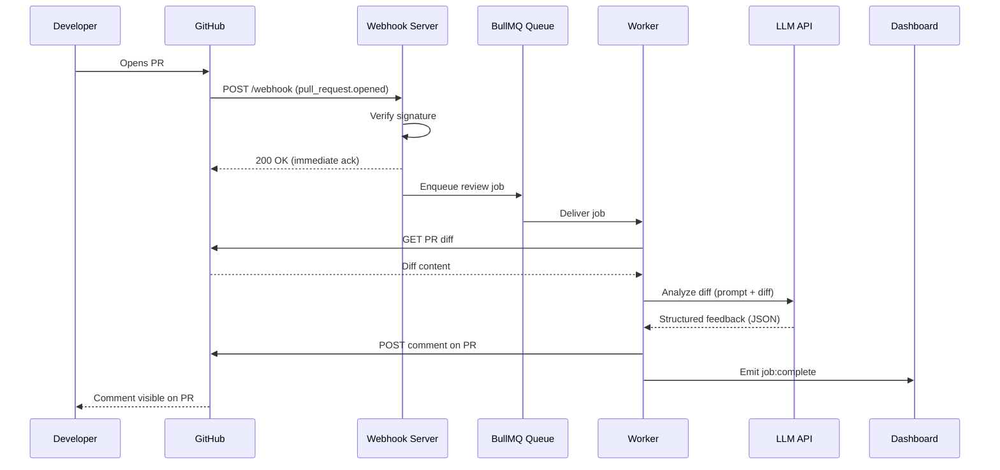
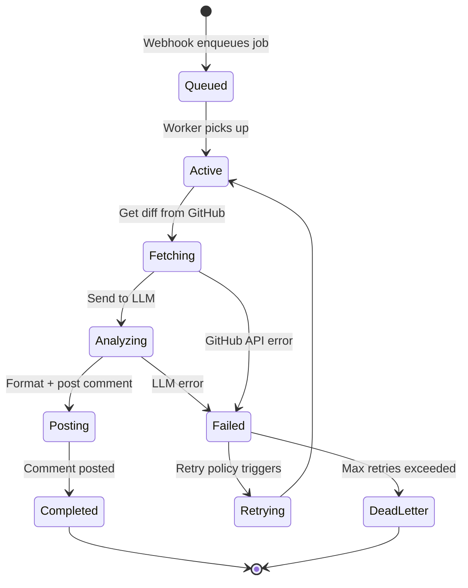
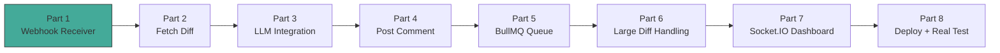

# AI PR Review Bot

An AI-powered GitHub App that automatically reviews pull requests. When a PR is opened or updated, the bot fetches the diff, sends it to an LLM for analysis, and posts a structured review comment back on the PR — summary, potential bugs, and style/logic concerns — without a human reviewer lifting a finger first.

---

## Table of Contents

- [Why this exists](#why-this-exists)
- [High-level architecture](#high-level-architecture)
- [End-to-end request flow](#end-to-end-request-flow)
- [Component breakdown](#component-breakdown)
- [Tech stack](#tech-stack)
- [Data flow: sequence diagram](#data-flow-sequence-diagram)
- [Job lifecycle (BullMQ)](#job-lifecycle-bullmq)
- [Project structure](#project-structure)
- [Setup](#setup)
- [Build phases / roadmap](#build-phases--roadmap)

---

## Why this exists

Human code review is slow and inconsistent — obvious bugs, unclear naming, or style issues often slip through simply because reviewers are busy or the diff is large. This bot acts as an automated first pass: it never sleeps, never skips a file because it's tired, and gives a consistent baseline review within seconds of a PR being opened.

---

## High-level architecture



**Reading this diagram:** the developer never talks to your bot directly — everything routes through GitHub. Your server only reacts to GitHub events and writes back to GitHub via its API. The dashboard is a side-channel purely for visibility; it's not required for the bot to function.

---

## End-to-end request flow



---

## Component breakdown

| Component | Responsibility | Why it exists |
|---|---|---|
| **Webhook Receiver** | Express endpoint that receives GitHub events | Entry point — nothing happens until GitHub calls this |
| **Signature Verifier** | HMAC-SHA256 check on every incoming request | Prevents forged requests from triggering the bot |
| **Diff Fetcher** | Calls GitHub's API to get changed code | The webhook only announces *that* something changed, not *what* |
| **Diff Chunker** | Filters/splits large diffs | LLMs have context limits; huge diffs also produce vague feedback |
| **LLM Client** | Sends diff + prompt, parses response | The actual "AI" in the project — generates the review content |
| **Job Queue (BullMQ + Redis)** | Buffers work between webhook and processing | GitHub expects a fast response; LLM calls are slow — decouples the two |
| **Worker** | Background process consuming the queue | Does the actual slow work without blocking the webhook endpoint |
| **Comment Poster** | Posts formatted feedback back to the PR | Closes the loop — this is what the developer actually sees |
| **Socket.IO Dashboard** | Live view of job status | Demo/portfolio value — turns an invisible script into a visible product |

---

## Tech stack



---

## Data flow: sequence diagram



---

## Job lifecycle (BullMQ)



---

## Project structure

```
pr-bot/
├── src/
│   ├── server.ts            # Express app, webhook endpoint
│   ├── verifySignature.ts   # HMAC signature verification
│   ├── github/
│   │   ├── fetchDiff.ts     # Get PR diff via GitHub API
│   │   └── postComment.ts   # Post review comment back to PR
│   ├── llm/
│   │   ├── prompt.ts        # System prompt + formatting
│   │   └── client.ts        # LLM API call wrapper
│   ├── queue/
│   │   ├── queue.ts         # BullMQ queue definition
│   │   └── worker.ts        # Background worker process
│   └── dashboard/
│       └── socket.ts        # Socket.IO event emitters
├── .env                      # Secrets (not committed)
├── .gitignore
├── package.json
├── tsconfig.json
└── README.md
```

---

## Setup

```bash
# 1. Install dependencies
npm install

# 2. Configure environment
cp .env.example .env
# then edit .env with your GitHub webhook secret, LLM API key, Redis URL

# 3. Run in development
npm run dev

# 4. Expose local server for GitHub (dev only)
ngrok http 3000
```

---

## Build phases / roadmap



**Status:** 🟢 Part 1 in progress — webhook receiver + signature verification.

| Phase | What it proves |
|---|---|
| 1. Webhook Receiver | GitHub can reach the server, and requests are verified as authentic |
| 2. Fetch Diff | Server can retrieve the actual code changes for a PR |
| 3. LLM Integration | The core AI value — diff in, structured review out |
| 4. Post Comment | The loop closes — feedback appears where developers actually look |
| 5. BullMQ Queue | The system stays reliable and responsive under load |
| 6. Large Diff Handling | The bot doesn't break or produce garbage on big PRs |
| 7. Socket.IO Dashboard | The project becomes demo-able as a visible product |
| 8. Deploy + Real Test | The bot runs live against real open-source PRs |